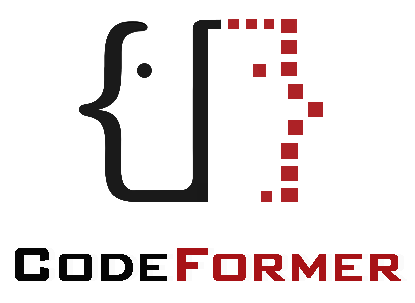
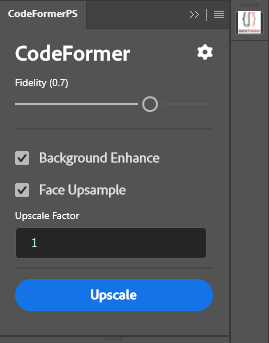
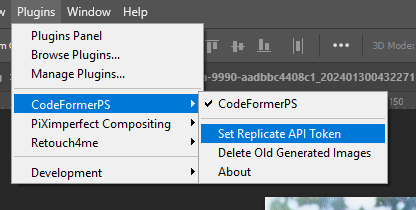

# CodeFormerPS
Use **CodeFormer AI** to upscale your image inside Photoshop

## Download
### [CCX FILE](https://github.com/Fus3n/code-former-ps/releases/tag/1.0.0)

## Upscale & Photo Restoration

## Fix AI Faces

## How to use

After installing the addon click *Plugins > CodeFormerPS > Set Replicate API Token*

[Get Your Replicate Token](https://replicate.com/account/api-tokens)

It does require you to login first then create 

This will prompt you to add your API Token, copy it from above link.

And you are ready!

Just select the image layer you want to send to Codeformer and it will do its job and add it as a layer, it will create a new document if upscale factor is more than 1 as the dimensions are differnet.

## Support
if you like the addon and wanna support me you can do it here

